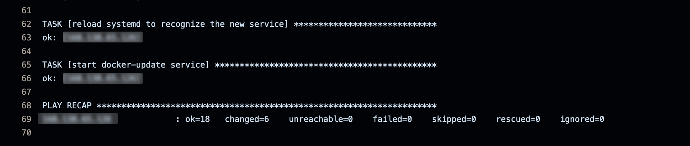

# OCI Product Service - Ansible Deployment

This repository contains an Ansible playbook to automate the deployment of a full-stack service (BotWhy) on an Oracle Cloud Infrastructure (OCI) instance.

## Features
- **Automated Deployment**: Uses Ansible to configure the OCI instance.
- **Service Management**: Installs dependencies and deploys the full-stack application.
- **Docker Support**: Manages containers for backend, frontend, and database services.
- **CI/CD Integration**: Uses GitHub Actions to automate deployment.

## Prerequisites
- Oracle Cloud Infrastructure (OCI) account with a free-tier instance.
- SSH access to the instance.
- Ansible installed on your local machine.
- Required OCI credentials configured.

## CI/CD Integration
The repository includes GitHub Actions to automate testing and deployment:
- Push to `main` triggers a build and deployment to OCI.
- Linting and testing are executed before deployment.

## License
MIT License

## Author
Jean-Michel Beaulieu-Bérubé
